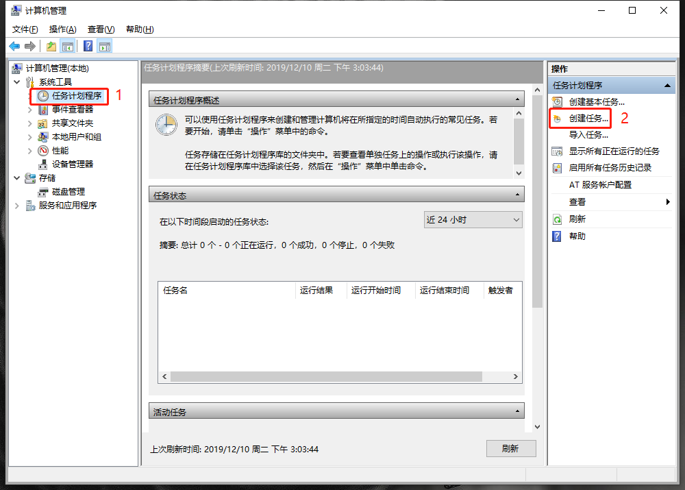
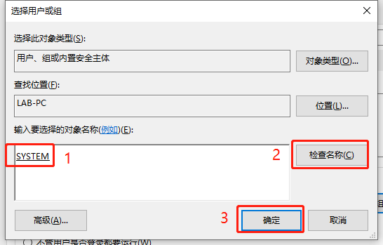
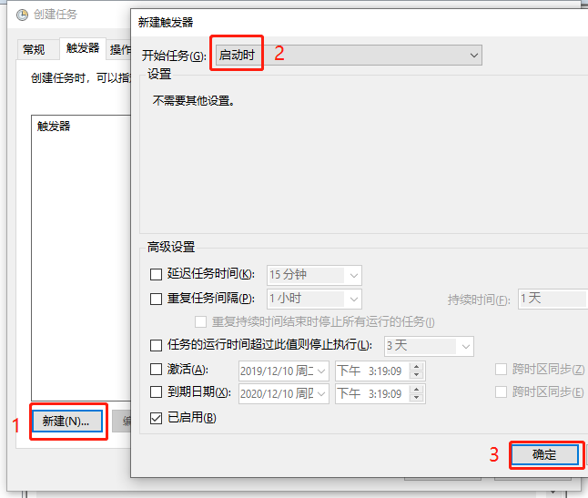
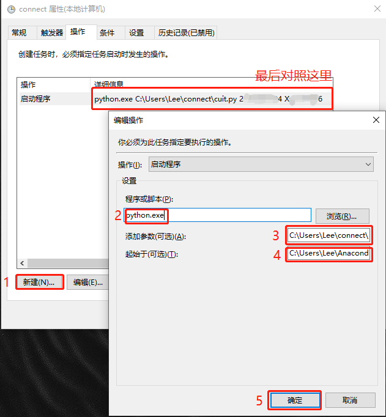
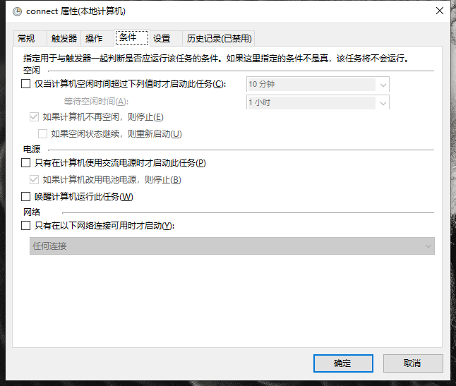
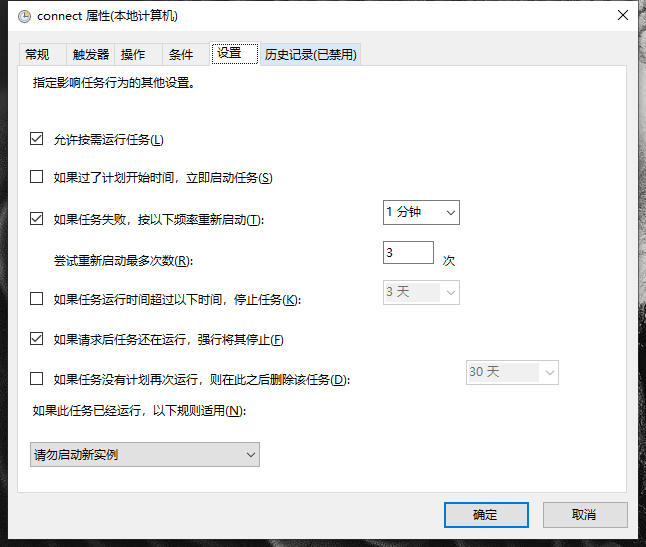
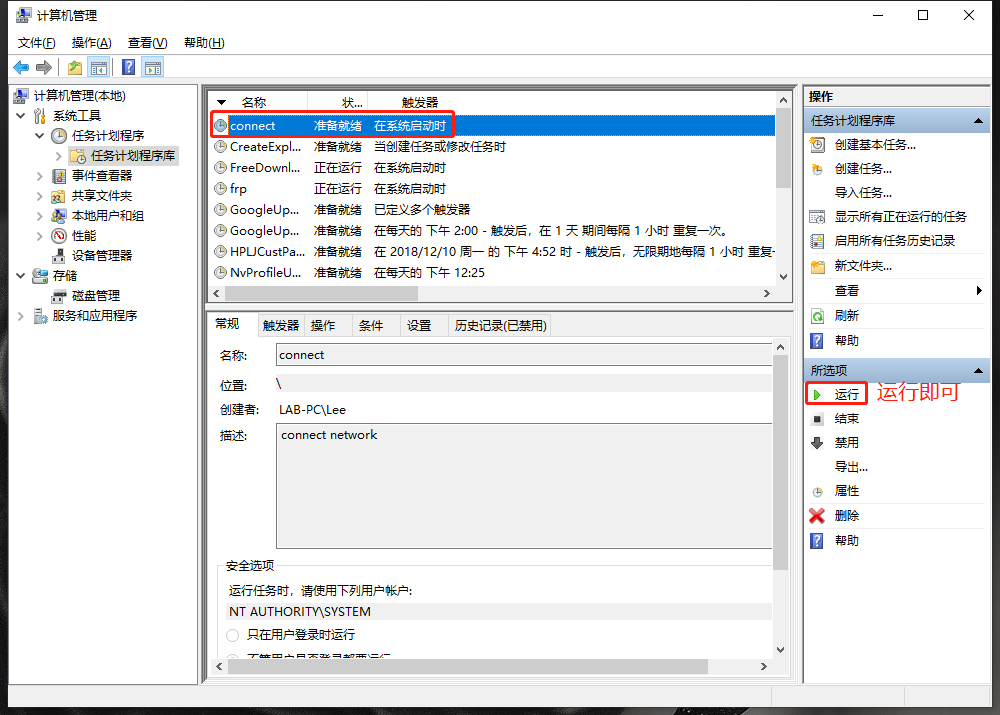

# CUIT实验室联网脚本
>这是一个用于自动连接CUIT（航空港校区）实验室校园网的Python脚本，此脚本并不适用于宿舍联网，龙泉校区如果用的同一套认证系统，可以适当修改脚本使用。

# 需求
### Python版本
- [x] __python 3.6+__
### 模块需求
- [x] __requests__
- [x] __json__
- [x] __sys__ 
- [x] __time__

如果您没有上述模块，请通过 `pip install xxx` 来安装模块，例如 `pip install requests`
# 用法
    python cuit.py username password
# 功能
- Web认证联网
- 发送心跳包维持在线
- 断线自动重连
# 加入Windows开机自启
1. 打开: 计算机管理-系统工具-任务计划程序-创建任务  

2. 常规：输入名称，点击“更改用户或组”；输入“system”，点击“检查名称”，确定    
  

3. 触发器：新建-选择“启动时”-确定  

4. 操作：新建-程序"python.exe"  
参数：cuit.py(绝对路径) username password，（例如：C:\Users\Lee\connect\cuit.py 2\******4 X\******6）    
起始于：python.exe所在路径，（例如：C:\Users\Lee\Anaconda3\）  

5. 条件：按图设置  

6. 设置：按图设置  

7. 回到任务界面选中运行即可  

